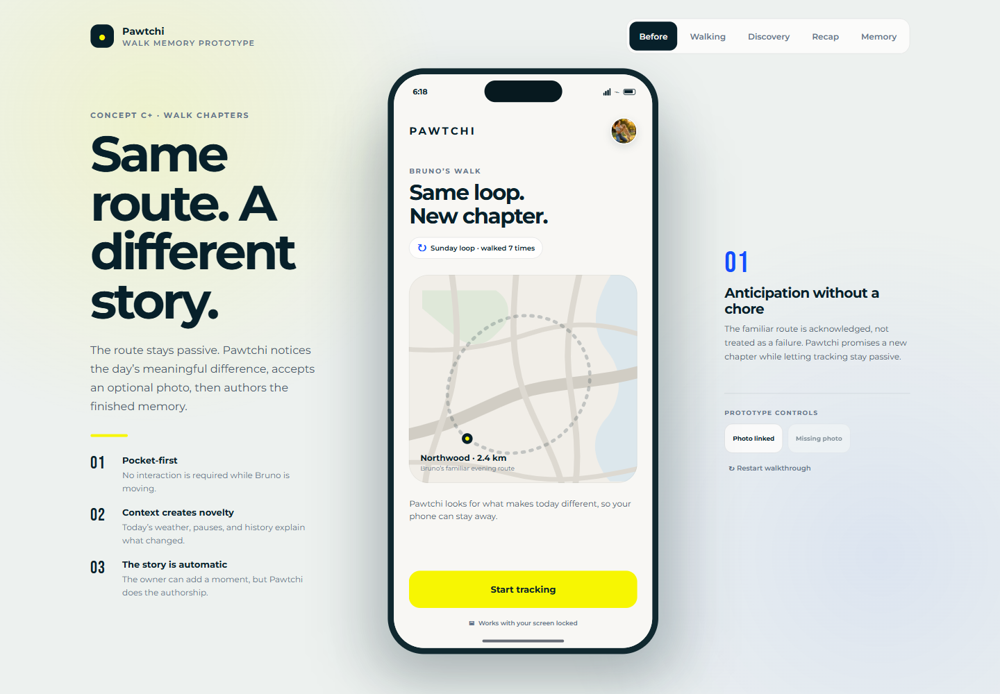
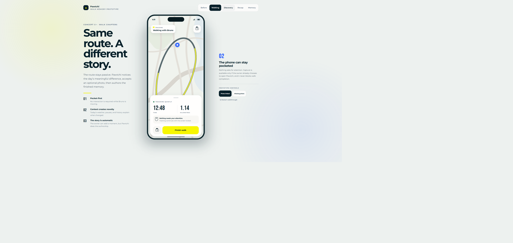

# Pawtchi Walk Memory Preview

Open [index.html](./index.html) directly in a browser, or serve the repository root with any static file server and visit the walk-memory-preview folder.

The demo is intentionally self-contained. It uses deterministic sample data and does not request authentication, GPS, photo permissions, or backend access.

Explore the five stages from the controls above the phone:

1. Before
2. Walking
3. Discovery
4. Recap
5. Memory

The reviewer controls beside the phone simulate a linked photo and the missing-media fallback. The Add Photo, privacy explanation, relink, and share-preview interactions are also clickable inside the phone.
